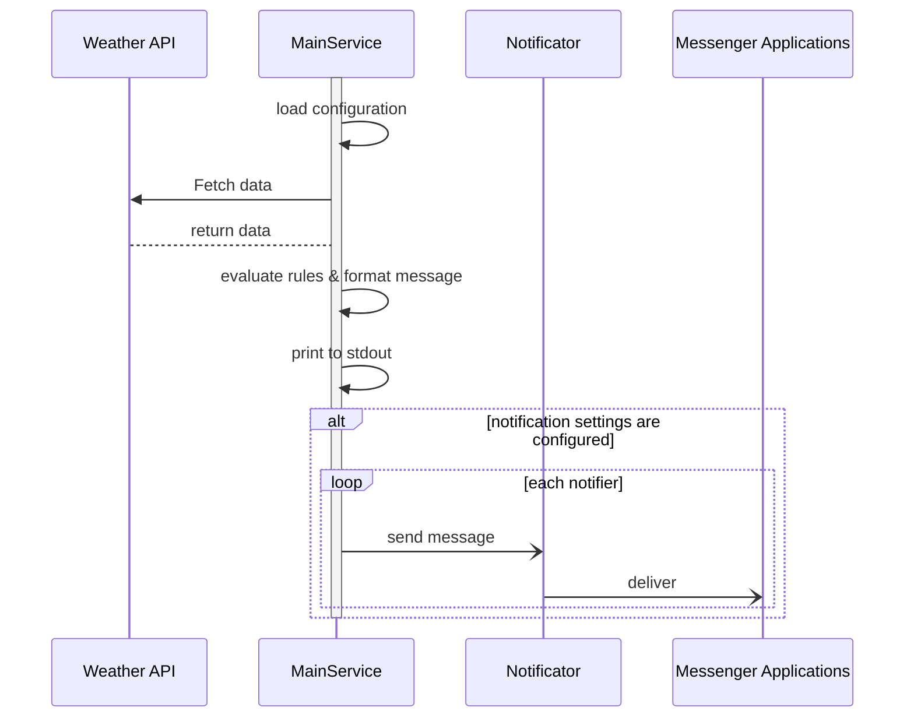

# Weather bot

This bot collects weather information and sends notifications to messenger services (Telegram, Slack, SMS, etc.)

The bot can be triggered by GitHub Actions or run directly from a terminal.

## Main features

1. Fetch data from Weather API sources.
2. Check rules and send notifications to messenger apps. For example:
   1. If there is a configuration that focuses on rain starts and stops, send those notifications.
   2. If not, send general forecast information.
3. Supported messenger apps: Telegram, Slack, SMS, Line, WhatsApp.

---

## Configuration

Configuration is loaded in priority order (highest wins):

```
CLI flags  >  environment variables  >  config file  >  code defaults
```

### Config file

By default the bot looks for `config.yaml` in:
1. The path given by `--config`
2. `./config.yaml`
3. `$HOME/.weather-bot/config.yaml`

Supported formats: `.yaml` / `.yml` / `.json`.

#### Full example — `config.yaml`

```yaml
location:
  lat: 10.823
  lon: 106.630

days: 3

rules:
  - name: rain-alert
    type: rain
  - name: cold-alert
    type: temp
    params:
      condition: lte
      value: "20.0"   # alert when temperature ≤ 20 °C
  - name: heat-alert
    type: temp
    params:
      condition: gte
      value: "38.0"   # alert when temperature ≥ 38 °C

sources:
  openweathermap:
    api_key: "YOUR_OWM_API_KEY"
  open-meteo: {}   # no credentials required

notifications:
  my-telegram:
    type: telegram
    params:
      bot_token: "123456:ABC-DEF"
      chat_id:   "-100123456789"
```

---

### Environment variables

Nested keys use `__` as the separator (e.g. `LOCATION__LAT` maps to `location.lat`).

| Variable | Required | Default | Description |
|---|---|---|---|
| `LOCATION__LAT` | **Yes** | — | Latitude of the target location |
| `LOCATION__LON` | **Yes** | — | Longitude of the target location |
| `DAYS` | No | `1` | Number of days from today to forecast |
| `RULES` | No | — | JSON array of rule configurations (see below) |
| `SOURCES` | No | — | JSON object of source configurations (see below) |
| `NOTIFICATIONS` | No | — | JSON object of notification configurations (see below) |

#### `RULES` — JSON array

Each element has a `type` and optional `params`. Multiple rules of the same type are allowed.

```json
[
  { "name": "rain-alert",  "type": "rain" },
  { "name": "cold-alert",  "type": "temp", "params": { "condition": "lte", "value": "20.0" } },
  { "name": "heat-alert",  "type": "temp", "params": { "condition": "gte", "value": "38.0" } }
]
```

Built-in rule types:

| Type | Params | Description |
|---|---|---|
| `rain` | — | Alert when rain is forecast |
| `temp` | `condition` (`lte`\|`gte`), `value` (number as string) | Alert on temperature threshold |

New rule types can be added without modifying existing code.

#### `SOURCES` — JSON object

Keys are arbitrary source names; the `api_key` field is source-specific.

```json
{
  "openweathermap": { "api_key": "YOUR_KEY" },
  "open-meteo":     {}
}
```

Supported source names: `openweathermap`, `open-meteo`.

#### `NOTIFICATIONS` — JSON object

Keys are arbitrary names you assign to each notification channel.

```json
{
  "my-telegram": {
    "type": "telegram",
    "params": {
      "bot_token": "123456:ABC-DEF",
      "chat_id":   "-100123456789"
    }
  }
}
```

Supported types: `telegram`.

---

### CLI flags

| Flag | Maps to | Description |
|---|---|---|
| `--config` | — | Path to a config file |
| `--lat` | `location.lat` | Latitude |
| `--lon` | `location.lon` | Longitude |
| `--days` | `days` | Number of forecast days |

---

## Message format

Output follows this markdown template (printed to stdout and sent to each notifier):

```
**Weather prediction**
1. **Location:** <location>
2. **dd/mm/YYYY** (today)
   1. **Temperature:** <lowest> - <highest> °C
   2. **Rain chances**: Yes/No
      1. From <hour> to <hour>
      2. From <hour> to <hour>
3. **dd/mm/YYYY** (tomorrow)
   1. **Temperature:** <lowest> - <highest> °C
   2. **Rain chances**: Yes/No
      1. From <hour> to <hour>
```

---

## Flows

### Main flow


