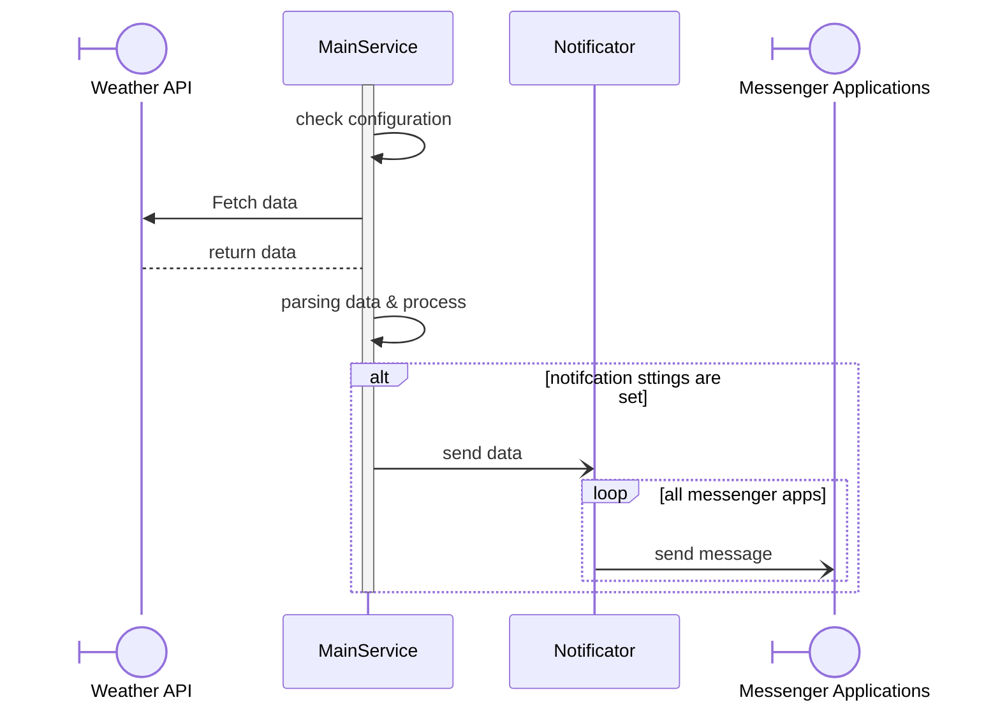

# Weather bot

This bot collects weather information and send to notifications to messenger services (telegram, slack, SMS, etc.)

This bot can be triggered by Github Actions, or from a command in termnial.

## Main features

1. Fetch data from Weather API sources.
2. Check rules and send notifications to messenger apps. For example:
   1. If there is configuration that focus on rain starts and stops, send the notifications.
   2. If not, send the general information.
3. Messenger apps can be: telegram, slack, SMS, Line, WhatsApp.

### Configurations

| Variable | Optional | Description |
|--|--|--|
| `LOCATION__LON` | Required | Longitute of location |
| `LOCATION__LAT` | Required | Lattitude of location |
| `SOURCES` | No | List of source names of Weather service, default empty |
| `DAYS` | No | Number of days from today to get the data, default `1` |
| `RULES__RAIN` | No | Default: false. If true, set the rain chances |
| `RULES__TEMP__LTE` | No | If set as a number, alert if the temprature less than or equal to the value |
| `RULES__TEMP__GTE` | No | If set as a number, alert if the temprature greater than or equal to the value |
| `NOTIFICATIONS` | No  | JSON or YAML formats, notification configuration |


`SOURCES` likes:

```json
[
    "source-name": {
        "host": "...",
        "credentials": "..."
    },
    "source-name-2": {}
]
```


`NOTIFICATIONS` configurations can be described in JSON string like this:

```json
[
    "<name of config>": {
        "type": "telegram",
        .... // other configurations to send the message to telegram through a bot.
    },
    "<name of config>": {
        "type": "email",
        .... // other configurations to send an email
    }
]
```

### Message template

Follow this message template in markdown, can markup base on each messenger apps.

```
**Weather prediction**
1. **Location:** \<location\>
2. **dd/mm/YYY** (today)
   1. **Temperature:** \<lowest\> - \<highest\> C
   2. **Rain chances**: Yes/No
      1. From \<hour> to \<hour>
      2. From \<hour> to \<hour>
3. **dd/mm/YYY** (tomorrow)
   1. **Temperature:** \<lowest\> - \<highest\> C
   2. **Rain chances**: Yes/No
      1. From \<hour> to \<hour>
      2. From \<hour> to \<hour>
```

## Flows

### Main flow

