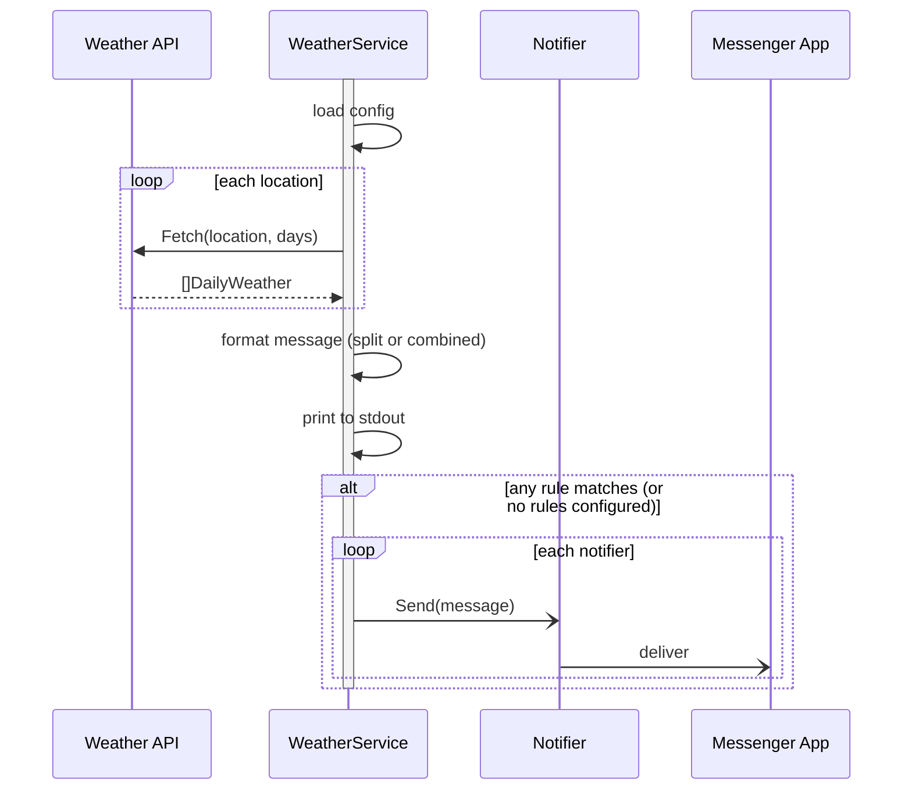

# Weather bot

This bot collects weather information and sends notifications to messenger services (Telegram, etc.)

The bot can be triggered by GitHub Actions or run directly from a terminal.

## Main features

1. Fetch data from multiple weather API sources (Open-Meteo, OpenWeatherMap).
2. Support multiple locations, each with its own timezone.
3. Evaluate configurable alert rules (rain, temperature thresholds) and send notifications.
4. Print the forecast to stdout; send to external notifiers only when a rule matches.
5. Deliver one combined message for all locations, or one message per location.

---

## Configuration

Configuration is loaded in priority order (highest wins):

```
CLI flags  >  environment variables  >  config file  >  code defaults
```

### Config file

The bot looks for `config.yaml` in:
1. The path given by `--config`
2. `./config.yaml`
3. `$HOME/.weather-bot/config.yaml`

Supported formats: `.yaml` / `.yml` / `.json`.

#### Full example — `config.yaml`

```yaml
locations:
  - name: Ho Chi Minh City
    lat: xx.xxxxx
    lon: xxx.xxxxx
    timezone: Asia/Ho_Chi_Minh
  - name: Hanoi
    lat: xx.xxxxx
    lon: xxx.xxxxx
    timezone: Asia/Bangkok

days: 3

message:
  split: false   # true = one message per location, false = all in one message

forecast:
  rain_threshold: 80   # minimum % probability to count as rain (0–100)

rules:
  - name: rain-alert
    type: rain
  - name: cold-alert
    type: temp
    params:
      condition: lte
      value: "20.0"
  - name: heat-alert
    type: temp
    params:
      condition: gte
      value: "38.0"

sources:
  open-meteo: {}          # no credentials required
  # openweathermap:
  #   api_key: "YOUR_KEY"

notifications:
  my-telegram:
    type: telegram
    params:
      bot_token: "123456:ABC-DEF"
      chat_id:   "-100123456789"
```

---

### Environment variables

Nested keys use `__` as the separator (e.g. `MESSAGE__SPLIT` maps to `message.split`).

Array and object blocks (`LOCATIONS`, `RULES`, `SOURCES`, `NOTIFICATIONS`) are passed as JSON strings and override the entire corresponding block in the config file.

| Variable | Default | Description |
|---|---|---|
| `DAYS` | `1` | Number of forecast days |
| `MESSAGE__SPLIT` | `false` | `true` = one message per location |
| `FORECAST__RAIN_THRESHOLD` | `80` | Minimum rain probability % to treat an hour as rainy (0–100) |
| `LOCATIONS` | — | JSON array of location objects (see below) |
| `RULES` | — | JSON array of rule objects (see below) |
| `SOURCES` | — | JSON object of source configs (see below) |
| `NOTIFICATIONS` | — | JSON object of notification configs (see below) |

#### `LOCATIONS` — JSON array

```json
[
  { "name": "Ho Chi Minh City", "lat": xx.xxxxx, "lon": xxx.xxxxx, "timezone": "Asia/Ho_Chi_Minh" },
  { "name": "Hanoi",            "lat": xx.xxxxx, "lon": xxx.xxxxx, "timezone": "Asia/Bangkok" }
]
```

| Field | Required | Description |
|---|---|---|
| `lat` | Yes | Latitude |
| `lon` | Yes | Longitude |
| `name` | No | Display name (falls back to `lat, lon`) |
| `timezone` | No | IANA timezone name (e.g. `Asia/Ho_Chi_Minh`). Falls back to UTC. |

#### `RULES` — JSON array

```json
[
  { "name": "rain-alert", "type": "rain" },
  { "name": "cold-alert", "type": "temp", "params": { "condition": "lte", "value": "20.0" } },
  { "name": "heat-alert", "type": "temp", "params": { "condition": "gte", "value": "38.0" } }
]
```

Built-in rule types:

| Type | Params | Description |
|---|---|---|
| `rain` | `threshold` (0–100 %, default 80) | Alert when rain is forecast |
| `temp` | `condition` (`lte`\|`gte`), `value` (°C as string) | Alert on temperature threshold |

When rules are configured, external notifications are sent only when at least one rule matches.
When no rules are configured, notifications are always sent.
New rule types can be added by registering a new evaluator — no existing code changes required.

#### `SOURCES` — JSON object

```json
{
  "open-meteo":     {},
  "openweathermap": { "api_key": "YOUR_KEY" },
  "weatherapi":     { "api_key": "YOUR_KEY" }
}
```

Sources are tried in order; the first successful response is used.
Supported: `open-meteo` (no key required), `openweathermap`, `weatherapi`.

#### `NOTIFICATIONS` — JSON object

```json
{
  "my-telegram": {
    "type": "telegram",
    "params": {
      "bot_token": "123456:ABC-DEF",
      "chat_id":   "-100123456789"
    }
  }
}
```

Supported types: `telegram`.

---

### CLI flags

| Flag | Description |
|---|---|
| `--config` | Path to a config file |
| `--days` | Number of forecast days (overrides config / env) |

---

## Message format

The forecast is always printed to stdout. The same text is sent to configured notifiers.

**Single location / split mode** (`message.split: true`):

```
**Weather forecast**
1. **Location:** Ho Chi Minh City (Asia/Ho_Chi_Minh)
2. **04/05/2026** (today)
   1. **Temperature:** 26.8 - 35.5 °C
   2. **Rain chances**: Yes
      1. From 14:00 to 16:00
3. **05/05/2026** (tomorrow)
   1. **Temperature:** 25.0 - 33.0 °C
   2. **Rain chances**: No
```

**Multiple locations / combined mode** (`message.split: false`):

```
**Weather forecast**

**Ho Chi Minh City (Asia/Ho_Chi_Minh)**
1. **04/05/2026** (today)
   1. **Temperature:** 26.8 - 35.5 °C
   2. **Rain chances**: Yes
      1. From 14:00 to 16:00

**Hanoi (Asia/Bangkok)**
1. **04/05/2026** (today)
   1. **Temperature:** 20.3 - 27.9 °C
   2. **Rain chances**: No
```

Times are shown in each location's configured timezone.

---

## Running

### Terminal

```bash
go run ./cmd/bot/
# override days inline
DAYS=3 go run ./cmd/bot/
# use a custom config file
go run ./cmd/bot/ --config /path/to/config.yaml
```

### GitHub Actions

The included workflow (`.github/workflows/daily-forecast.yml`) runs every day at **20:00 GMT+7** and forecasts 3 days ahead.

Required repository secrets:

| Secret | Value |
|---|---|
| `LOCATIONS` | JSON array (see `LOCATIONS` env var above) |
| `NOTIFICATIONS` | JSON object (see `NOTIFICATIONS` env var above) |

Trigger a manual run from **Actions → Daily Weather Forecast → Run workflow**.

---

## Flows


